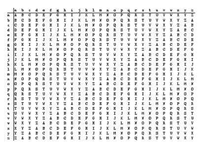

# Key Ciphers

A principle in cryptography called the _Kerckhoffs's principle states:

"A cryptosystem should be secure even if everything about the system, except the key, is public knowledge."

One old algorithm that was used to encrypt data using a key was "Vigenere". It looks strong than the previous algorithms, even though it is easily breakable nowadays, in its time it was considered unbreakable.

## Vigenere Example

**Cleartext**: "I LOVE PITTSBURGH"

First, remove the space, because the Vigenere table does not have the space. However, a human can easily recognize the words of a text even if it has no spaces:

"ILOVEPITTSBURGH"

Now we can pick a key, and for this example we will use "PICOCTF". Since our text is larger than the key, we simply repeat the key several times until we get the same length in the following manner:

**Plaintext**: ILOVEPITTSBURGH
**Key**: PICOCTFPICOCTFP

The first letter of the cleartext is paired with the first letter of the key. So, we have the pair ('I','P') Now in the vigenere table that is presented below, we use the row i and column p. The celle at the intersection of the column and the row will be the encrypted letter, which in this case is X. We do the same for the rest of the letters, and we would obtain the following:

**Encrypted text**: XTQJGINIBUPWKLW

---
